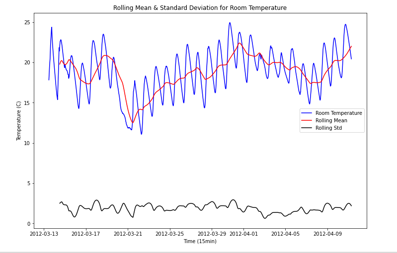

# Home Temperature Time Series Forecasting

Energy consumption is a critical issue today. Inside homes, heating, ventilation, and air conditioning (HVAC) systems are responsible for a high amount of the home’s total energy consumption, about 53.9%. However, the energy needed to raise or lower temperature in a home is more than the energy required to maintain it. We’d like to develop a system to generate a short term forecast of indoor temperature. The system aims to reduce the power consumption of any home’s HVAC. If we can predict the temperature in the house, we can better control when to use HVAC to raise, lower, or simply maintain temperature.

The goal is, therefore, to reduce energy consumption by predicting the indoor temperature of a
room, in order to choose whether or not to activate the HVAC system.

# The Data

The raw_data folder contains the train.csv table, which is a dataset consisting of about 2000 sets of measurements. The measurements include things like CO2 concentration, relative humidty, irradiance, and light levels from sensors in various places around the house. A description of all columns can be found in the Explanation of Columns document. The raw data came from Kaggle: 

https://www.kaggle.com/competitions/smart-homes-temperature-time-series-forecasting/

The Data folder contains the altered versions of the original dataset I have made in the course of the project. train_cleaned.csv is the cleaned version of the dataset, post data wrangling. test_scaled_df.csv and train_scaled_df.csv are the post processing train and testing sets, ready to be modeled. 

# Modeling

We have, in a sense, two sets of explanatory variables that may explain our target variable: time (how the room temperature changes over time), and the rest of the measurement data (how does co2/light/precipitation affect the room temperature). A SARIMAX model can handle both sets of explanatory variables at once by accepting a set of exogenous variables. For comparison, we also tried a random forest regressor model and a linear regression model, which do not incorporate the element of time by default. We introduced temporality into these atemporal models by engineering a feature into our table of the temperatures lagged by one period. 

Our data was split into 80% training data and 20% testing data. To do so, we manually split at the 80% index point, so as to preserve the order of the data. Our metric of choice here was root mean squared error (rmse), which is a standard for regression tasks.

We manually determined the parameters the first SARIMAX with acf and pacf plots. This model took a very long time to fit, on the order of 30 minutes. Attempts to automatically obtain optimal parameters with auto_arima resulted in consistent memory crashes. We suspect the high seasonality was causing all the slow training and memory errors. We addressed this by downsampling the temperature measurement frequency to one hour, which drastically speeded up model fitting time, and even improved accuracy. The SARIMAX models were outdone by the 

In the end the SARIMAX models were outdone by the random forest regressor and linear regression models. The linear regression model scored best, with an out of sample rmse of 0.072 C.

# Libraries/Packages

- numpy 1.21.2
- pandas 1.3.3
- matplotlib 3.4.3
- seaborn 0.11.2
- scikit-learn 0.24.2
- statsmodels 0.12.2
- pmdarima 1.8.5